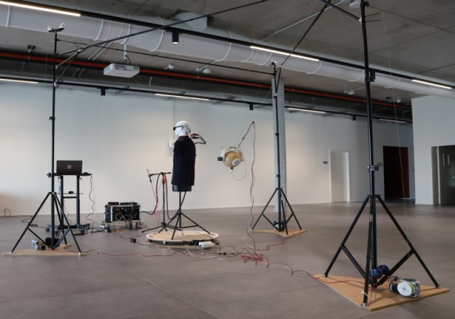

Auralys = Auris + Analysis

Auralys is an automated system for the measurement of head related transfer functions (HRTF) and room impulse
responses (RIR) of wearable devices carrying an array of microphones. It was built to characterise a pair of
glasses with six MEMS microphones, mounted on a 3D printed head, but the measurement system does not depend on
the device: any object with any number of microphones can be placed at the centre of the rig.

The whole system is designed to be rebuilt from this repository: 3D printed parts, off-the-shelf components,
electronics, firmware and software are all here, and no proprietary hardware or software is required.



## What it does

A measurement campaign presents a loudspeaker at every direction of a grid around the device under test, plays an
exponential sine sweep at each direction, and records all the microphones together with a copy of the stimulus on
a single multichannel audio interface, so that all the tracks share one clock. The recordings are then processed
offline into impulse responses and assembled into AES69-2022 (SOFA) files.

The loudspeaker is moved in three dimensions by a cable suspension: three poles, each with a stepper motor winding
a thin rope, hold the speaker at any point of the working volume, and a small gimbal keeps it pointed at the
device. The device itself sits on a turntable that provides the azimuth rotation. Every motor is driven by the
same controller board and the same firmware (`firmware/auralysSpeaker`), configured for its role, and the host
talks to all of them over WiFi through a small REST API.

The work is split in two steps that never run together:

1. **Capture**, driven by `auralysCaptureHRTF.py`: positions the speaker, rotates the table, plays and records the
   sweep, and leaves on disk one folder per direction with the recording and a complete description of the setup
   (`config.yaml`).
2. **Processing**, done by the scripts under `hrtf/`: deconvolution, time of arrival detection, and SOFA
   generation. This step reads only what the capture wrote and can be repeated at any time on any machine.

## Repository layout

| folder | content |
| --- | --- |
| `hardware/` | 3D models, schematics and gerber files: speaker, gimbal, turntable, poles and pulleys, motor controller, MEMS microphone board, power splitter, printed head (OpenAural) |
| `firmware/auralysSpeaker/` | Arduino sketch for the ESP32-S3 motor controller (pole, speaker gimbal, turntable), plus `cli/auralys_ctrl.py`, the command line tool that converts a position into rope lengths and drives the units |
| `hrtf/` | sweep recording (`record_ess_map.py`, `record_ess.py`), impulse response and SOFA computation (`compute_hrir.py`, `compute_3dti_sofa.py`, `compute_sofa.py`), tools; `ess_params.yaml` and `ess_map_params.yaml` describe the setup and the campaign |
| `audio/` | recording of ordinary audio material (not sweeps) over the same positioning loop |
| `docs/` | notes and coordinate tables |
| `auralysCaptureHRTF.py` | top level script for a full HRTF map (this file) |
| `auralysCaptureAudio.py` | top level script for an audio map with the same positioning loop |

Detailed documentation of the individual scripts will be added under `docs/`.

## Requirements

Hardware: the rig as described in `hardware/`, three pole units, one speaker unit and one turntable unit flashed
with the firmware and reachable on the local network, and one audio interface capable of simultaneous playback
and multichannel recording at 96 kHz, 24 bit (the scripts were developed with an RME Fireface UFX and a Focusrite
Scarlett 18i20).

Software: Linux with ALSA (`aplay` is used to find the interface), Python 3 with `numpy`, `pyyaml`, `sounddevice`,
`soundfile`, `requests`, `wget` and `multiprocess` for the capture step; the processing step additionally needs
`scipy`, `pyfar`, `sofar`, `matplotlib` and `setproctitle` (see `hrtf/readme.txt`).

## Running a capture with auralysCaptureHRTF.py

The script has no command line options: everything it needs is a constant at the top of the file, above the line
`DO NOT MODIFY CODE BELOW THIS LINE`. Before the first run:

1. Configure the positioning tool. The IP addresses of the five units, the geometry of the poles (heights and
   distances from the turntable) and the rope calibration constants are at the top of
   `firmware/auralysSpeaker/cli/auralys_ctrl.py`. Check them with a manual move:

   ```
   ./firmware/auralysSpeaker/cli/auralys_ctrl.py -c set position -p 1000,0,1650 -rs 0 -t ac -v
   ./firmware/auralysSpeaker/cli/auralys_ctrl.py -c cmd gozero -rs 0 -rt 0 -v
   ```

2. Describe the setup in `hrtf/ess_params.yaml`: the receivers (name, description, track index on the audio
   interface, position in the listener frame), the emitter (the speaker and the track of its loopback), the room,
   the author and the licence. This file is copied into every measurement as `config.yaml` and everything the
   processing knows about the setup comes from it.

3. Set the sweep parameters and the azimuth grid in `hrtf/ess_map_params.yaml`, or accept the defaults (20 Hz to
   20 kHz, 15 s, amplitude 0.8, 2 s of silence before and after, 96 kHz, 24 bit).

4. Edit the constants of `auralysCaptureHRTF.py`:
   - `_AUDIO_RECORDING_DEVICE_ID` / `_AUDIO_PLAYBACK_DEVICE_ID`: the name of the interface as printed by
     `aplay -l`; both must be the same interface;
   - `_AZIMUTH_BEGIN`, `_AZIMUTH_END`, `_AZIMUTH_STEP`: the azimuth range of every ring (default 360 down to 5 in
     steps of -5, that is 72 directions);
   - `auralysPositions`: one row per elevation ring, `[elevation, x, z]` in degrees and millimetres, with the
     speaker on a circle of 1 m radius around the head origin. Comment out the rows you do not need;
   - the output folder and the session name in the `record_ess_map.py` call (`-m` and `-n`).

Then, with the rig at its home position and the device under test on the table:

```
./auralysCaptureHRTF.py
```

For each ring the script moves the speaker, tilts it towards the head, waits for the ropes to settle, and starts
`hrtf/record_ess_map.py`, which rotates the table to every azimuth and records one sweep per direction. At the end
the speaker and the table are sent back to zero. An elevation the speaker could not reach, or a direction that
could not be recorded, is skipped and listed at the end, and the exit code is non-zero: a run that ends without
errors is complete.

The output is one folder per direction under the session folder:

```
<session>/
  <name>_+000+030+001_xAngle/      azimuth 0, elevation +30, distance 1 m
    config.yaml                    setup and stimulus actually used
    sweep_0.wav                    all interface inputs, 24 bit, 96 kHz
    sweep_99.wav                   preamble recording, not used
  <name>_+355+030+001_xAngle/
  ...
```

A dry run of the mechanics without audio is possible by adding `-t` to the `record_ess_map.py` call in the
script.

## Processing the recordings

The scripts under `hrtf/` turn a session folder into impulse responses and SOFA files; `hrtf/runme_all.sh` runs
the complete sequence on one session and `hrtf/usage_notes.txt` shows the individual commands. The resulting SOFA
files are the input of the [VERSE](https://github.com/iot-unimore/verse) framework.

## Note on the output location: `-m` and `-n`

The two values that change at every campaign are the output folder and the session name, the `-m` and `-n`
options of `hrtf/record_ess_map.py`. They are passed by `auralysCaptureHRTF.py` in its call to
`record_ess_map.py` and are the first thing to edit before a run:

```
"-m", "/media/gfilippi/audiodata/auralysNoHead_20260905-001",   # output folder of the session
"-n", "auralysNoHead",                                          # session name, prefix of every direction folder
```

`-m` is the session folder, created if it does not exist; a full map is several gigabytes of 24 bit
multichannel audio, so point it to a drive with room. Its last path component becomes the prefix of the SOFA
files produced later (`auralysNoHead_20260905-001_binaural.sofa` and so on). `-n` is the prefix of the folder of
every direction (`<name>_+AAA+EEE+DDD_xAngle`) and of the `config.yaml` entries that name it.
Running twice with the same `-m` and `-n` overwrites the recordings of the directions in common, so use a new
session folder for every campaign.
